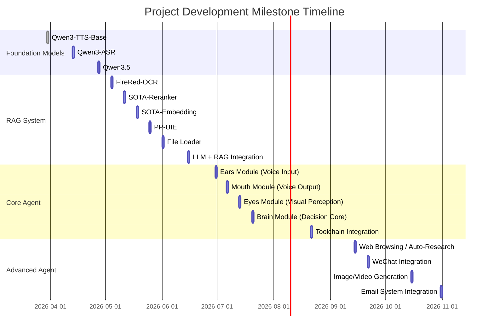
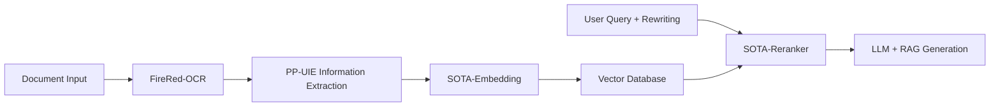
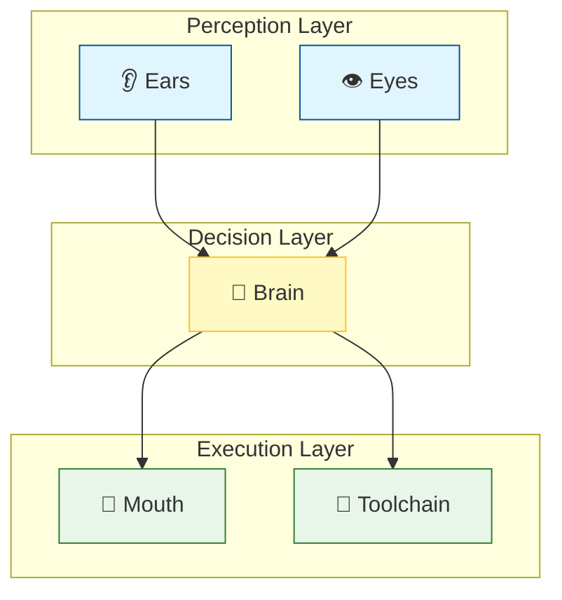
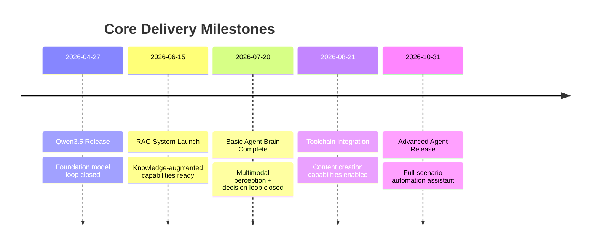
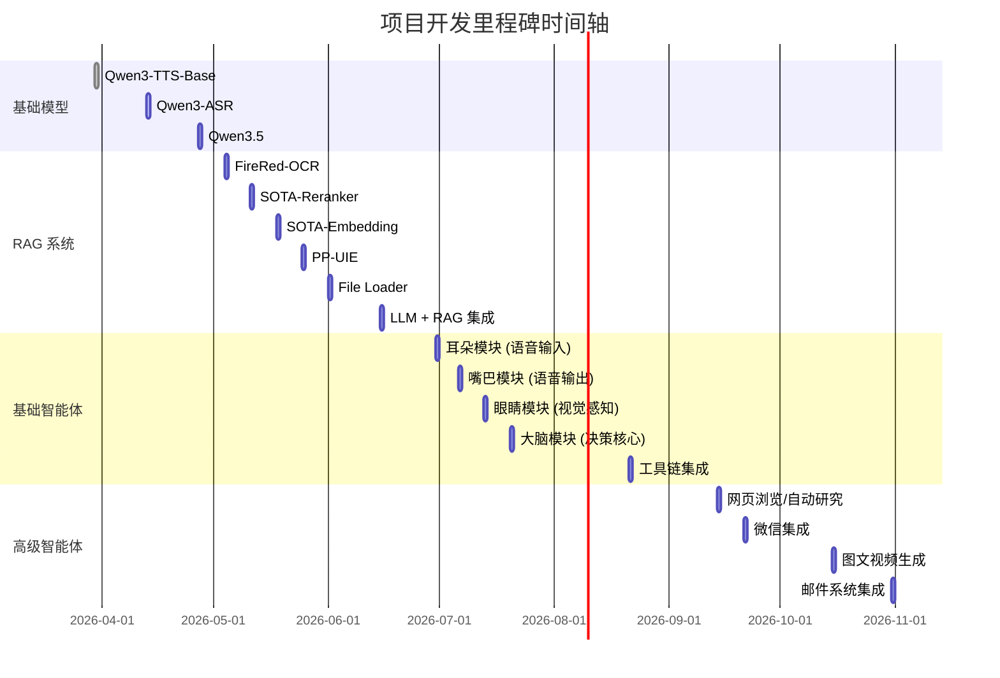
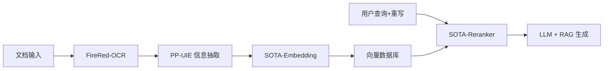
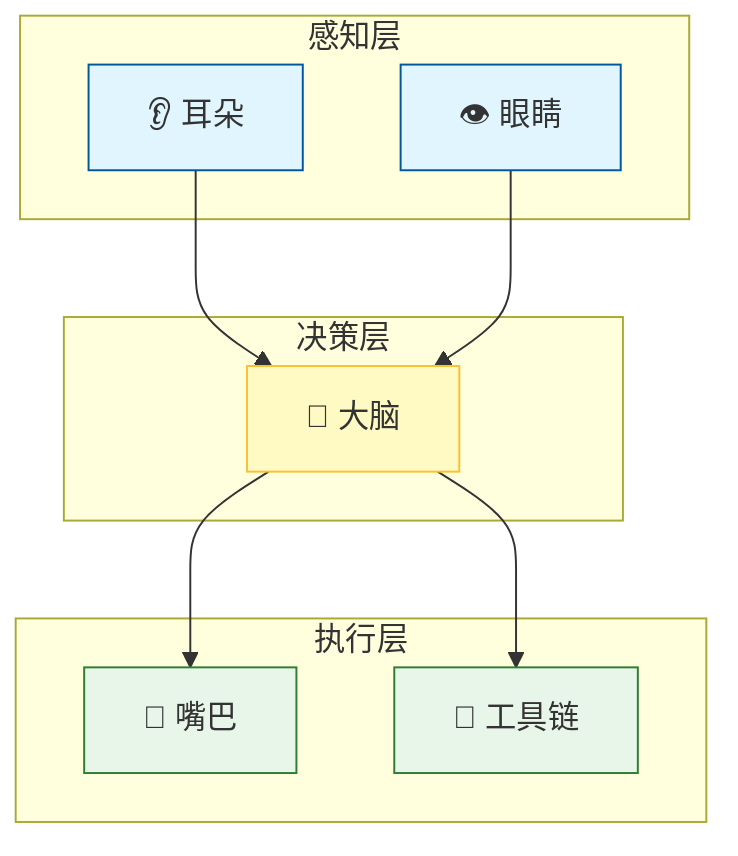
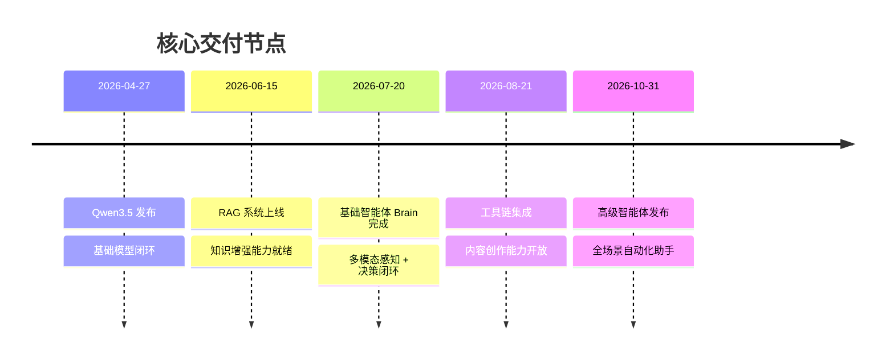

# 🗓️ Project Development Roadmap
> **Objective**: Build a multimodal, locally-deployable intelligent agent system

---

## 📊 Master Timeline Overview

---

## 📋 Module-by-Module Detailed Schedule

### 🔹 Phase 1: Foundation Model Releases

| Date | Module | Description | Status |
|------|--------|-------------|--------|
| 2026-03-30 | Qwen3-TTS-Base | text-to-speech model | 🔄 In Progress |
| 2026-04-13 | Qwen3-ASR | Automatic speech recognition model | ⏳ Pending Start |
| 2026-04-27 | Qwen3.5 | Upgraded flagship language model | ⏳ Pending Start |

---

### 🔹 Phase 2: RAG System Construction

| Date | Component | Function | Dependencies |
|------|-----------|----------|--------------|
| 2026-05-04 | FireRed-OCR | High-precision document text recognition | - |
| 2026-05-11 | SOTA-Reranker | Retrieval result re-ranking optimization | Embedding |
| 2026-05-18 | SOTA-Embedding | Semantic vector encoding | - |
| 2026-05-25 | PP-UIE | Universal information extraction framework | OCR |
| 2026-06-01 | File Loader | Multi-format file loader | - |
| 2026-06-15 | **LLM + RAG** | 🎯 Retrieval-Augmented Generation system integration | All above |

---

### 🔹 Phase 3: Basic Local Agent

#### 🧩 Module Architecture Diagram

#### 📅 Development Schedule

| Date | Module | Sub-components | Technical Highlights |
|------|--------|---------------|---------------------|
| **2026-06-30** | 👂 Ears | VAD + AEC + Noise Suppression + ASR + Voiceprint Recognition + Source Separation | End-to-end speech front-end processing |
| **2026-07-06** | 👄 Mouth | TTS + Voice Cloning + Audio Super-Resolution | High-fidelity speech synthesis |
| **2026-07-13** | 👁️ Eyes | OCR + Object Localization + Vision LLM | Multimodal visual understanding |
| **2026-07-20** | 🧠 Brain | Task Routing + Text LLM + Information Extraction + RAG | Core decision engine |
| **2026-08-21** | 🔧 Toolchain | Image Editing / Video Generation / Subtitle Generation | Multimodal content creation |

---

### 🔹 Phase 4: Advanced Local Agent

| Date | Feature | Use Cases | Priority |
|------|---------|-----------|----------|
| 2026-09-14 | 🌐 Web Browsing / Auto-Research | Information gathering | High |
| 2026-09-21 | 💬 WeChat Integration | Social automation | High |
| 2026-10-15 | 🎨 Image/Video Generation + Subtitles | Content creation | Medium |
| 2026-10-31 | 📧 Outlook / Gmail Integration | Email management, smart replies | Medium |

---

## 💻 Hardware Support Plan

| Phase | Platform | Status | Notes |
|-------|----------|--------|-------|
| **Initial Support** | CPU (x86/ARM) | ✅ Planned | |
| **Initial Support** | NVIDIA CUDA | ✅ Planned | |
| **Future Consideration** | Intel OpenVINO | ⏳ Under Evaluation | |
| **Future Consideration** | AMD MIGraphX | ⏳ Under Evaluation | |

---

## 📦 Pending Features Backlog (TBD)

> Features below will be scheduled dynamically based on resources and priority

### 🔍 Vision & Multimodal
- [ ] SOTA-Pipeline-OCR (PP-OCRv5 + PP-StructureV3 + GLM-OCR)
- [ ] SOTA-End2End-OCR (Qianfan-OCR)
- [ ] Face & Object Detection
- [ ] Human & Object Tracking
- [ ] Depth Estimation
- [ ] Face Recognition
- [ ] Sound Source Localization

### 🔊 Audio & Speech
- [ ] Audio LLM (Large Audio Understanding Model)
- [ ] Audio Generation (Music/SFX)
- [ ] SOTA-Emotion-TTS (Emotional Speech Synthesis)
- [ ] Qwen3-ASR-ForcedAligner (Forced Alignment)

### 🧠 Domain-Specialized Models
- [ ] Science & Math LLM
- [ ] Code LLM (Code Agent)

---

## 🎯 Key Milestone Checkpoints

---

# 🗓️ 项目开发路线图
> 目标：构建支持多模态、本地部署的智能体系统

---

## 📊 整体时间轴总览

---

## 📋 分模块详细进度表

### 🔹 阶段一：基础模型发布

| 日期 | 模块 | 内容说明 | 状态 |
|------|------|----------|------|
| 2026-03-30 | Qwen3-TTS-Base | 文本转语音模型 | 🔄 进行中 |
| 2026-04-13 | Qwen3-ASR | 自动语音识别模型 | ⏳ 待启动 |
| 2026-04-27 | Qwen3.5 | 升级版主语言模型 | ⏳ 待启动 |

---

### 🔹 阶段二：RAG 系统构建

| 日期 | 组件 | 功能描述 | 依赖关系 |
|------|------|----------|----------|
| 2026-05-04 | FireRed-OCR | 高精度文档文字识别 | - |
| 2026-05-11 | SOTA-Reranker | 检索结果重排序优化 | Embedding |
| 2026-05-18 | SOTA-Embedding | 语义向量化编码 | - |
| 2026-05-25 | PP-UIE | 通用信息抽取框架 | OCR |
| 2026-06-01 | File Loader | 多格式文件加载器 | - |
| 2026-06-15 | **LLM + RAG** | 🎯 检索增强生成系统整合 | 以上全部 |

---

### 🔹 阶段三：基础本地智能体（Basic Local Agent）

#### 🧩 模块架构图

#### 📅 开发排期

| 日期 | 模块 | 子组件 | 技术要点 |
|------|------|--------|----------|
| **2026-06-30** | 👂 耳朵 | VAD + AEC + 降噪 + ASR + 声纹识别 + 声源分离 | 语音前端处理全链路 |
| **2026-07-06** | 👄 嘴巴 | TTS + 语音克隆 + 音频超分 | 高保真语音合成 |
| **2026-07-13** | 👁️ 眼睛 | OCR + 目标定位 + Vision LLM | 多模态视觉理解 |
| **2026-07-20** | 🧠 大脑 | 任务路由 + Text LLM + 信息抽取 + RAG | 核心决策引擎 |
| **2026-08-21** | 🔧 工具链 | 图像编辑 / 视频生成 / 字幕生成 | 多模态内容创作 |

---

### 🔹 阶段四：高级本地智能体（Advance Local Agent）

| 日期 | 功能 | 应用场景 | 优先级 |
|------|------|----------|--------|
| 2026-09-14 | 🌐 网页浏览 / 自动研究 | 信息搜集 |
| 2026-09-21 | 💬 微信集成 | 社交自动化 | 
| 2026-10-15 | 🎨 图像/视频生成 + 字幕 | 内容创作 | 
| 2026-10-31 | 📧 Outlook / Gmail 集成 | 邮件管理、智能回复 |

---

## 💻 硬件支持计划

| 阶段 | 平台 | 状态 | 备注 |
|------|------|------|------|
| **首批支持** | CPU (x86/ARM) | ✅ 计划中 | 
| **首批支持** | NVIDIA CUDA | ✅ 计划中 | 
| **待定规划** | Intel OpenVINO | ⏳ 评估中 |
| **待定规划** | AMD MIGraphX | ⏳ 评估中 |

---

## 📦 待定功能池（TBD Backlog）

> 以下功能将根据资源与优先级动态排期

### 🔍 视觉与多模态
- [ ] SOTA-Pipeline-OCR（PP-OCRv5 + PP-StructureV3 + GLM-OCR）
- [ ] SOTA-End2End-OCR（Qianfan-OCR）
- [ ] 人脸 & 物体检测
- [ ] 人体 & 物体追踪
- [ ] 深度估计
- [ ] 人脸识别
- [ ] 声源定位

### 🔊 音频与语音
- [ ] Audio LLM（音频理解大模型）
- [ ] 音频生成（音乐/音效）
- [ ] SOTA-Emotion-TTS（情感语音合成）
- [ ] Qwen3-ASR-ForcedAligner（强制对齐）

### 🧠 专业领域模型
- [ ] 科学 & 数学 LLM
- [ ] 代码 LLM（Code Agent）

---

## 🎯 关键里程碑检查点

---
